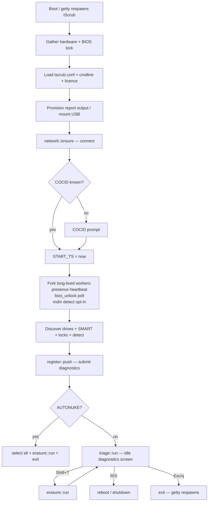

# tScrub triage-first conversion — TODO

Status: RELEASED as v1.10.0 (2026-10-01) — all Phases 0–4 done, appliance ISO
rebuilt (`95ece3a3`), script signed + hosted, PXE bzImage signed, site deployed.
Source of truth for the appliance rework.
Goal: turn tScrub from an "erasure tool with diagnostics" into a **triage tool**:
Boot → connect → submit diagnostics → long-lived heartbeat + BIOS-unlock (+ opt-in
MDM) → triage screen. Erasure is a **repeatable sub-workflow entered only via
Shift+T**, and it returns **seamlessly** to the triage screen (heartbeat never stops).

## Implementation progress (2026-10-01)
- [x] Phase 0 — decouple COCID from autonuke + timer/network
- [x] Phase 1 — long-lived telemetry workers (heartbeat / BIOS-unlock / MDM)
- [x] Phase 2 — extract `erasure::run`
- [x] Phase 3 — triage screen + Shift+T wiring
- [x] Phase 4 — docs + tests (4.1–4.6 done)
- [x] Phase 4.7 — appliance/ISO release + `npm run deploy` (commit, scp fsoverlay,
      `make`, publish ISO/manifest, deploy)

Changed files: `product/src/{00_bootstrap,10_main,20_ui,30_device,35_mdm,40_table,
99_entrypoint}.sh`; `product/tests/{lib,test_select,test_smoke,test_triage}.sh`;
`tests/proxmox/mdm-tui-test.sh`, `tests/proxmox/scenarios/13_tscrub_conf_bom.sh`;
`marketing/site/docs.html`, `marketing/site/public/{llms,llms-full}.txt`,
`ROADMAP.md`, `CHANGELOG.md`. Full suite (20 files) passes; `make build-slim` clean;
`npm run build` clean.

## Post-plan bug fixes (found during the test pass, beyond the original checklist)
- `erasure::run` now calls `table::build` (not just a status reset) so a repeat
  erasure re-classifies drives — `device::normalize_outcome` rewrites
  class/cert/method for non-completed drives each cycle.
- `erasure::run` resets the per-cycle `REPORT_{USB,DASH,NET}_STATUS`/`REASON`
  globals so a repeat erasure can't inherit a stale `fail`.
- `session::teardown()` (EXIT trap) kills the long-lived presence / BIOS-unlock /
  MDM / register workers on exit — a non-interactive shell does not kill `&` jobs,
  so without it they would orphan and stack across getty respawns.
- `product/tests/lib.sh` now sources `10_main.sh` (it defines `fn_main` /
  `erasure::run` / `session::teardown`, previously untestable); added
  `product/tests/test_triage.sh` (11 checks covering erasure::run repeatability,
  per-cycle state reset, and worker teardown).
- Deviation from 3.1: the headless (no-tty) triage fallback runs `erasure::run`
  (select-all wipe) rather than "render once + exit", preserving the old
  select-all behaviour for unattended boots (Proxmox scenario 13 + mdm-tui-test).
- `session::teardown` also calls `report::sync_out` — a pure-triage exit (Esc
  without erasing) otherwise leaves the boot-time diagnostics snapshot
  un-synced on the USB (lost on power-off) and leaks the mount across getty
  respawns.
- `network::ensure` moved to AFTER the COCID prompt + `START_TS` — it was
  stalling the COCID prompt by up to ~20s on no-network machines (carrier wait).
- UI pass fix: the finish screen (green/red/amber) + report-delivery summary +
  drive guidance are now kept as the **post-erasure result view** instead of
  being immediately replaced by a blue re-render — `erasure::run` sets
  `TRIAGE_MODE=1` before painting the finish (so its footer carries the triage
  key legend), and `triage::run` keeps the screen up (timer still ticks, no
  full re-render) until the next keystroke (Shift+T / R / S / Esc).
- Selection-abort fix: Esc on the selection screen no longer leaves a frozen
  selection screen (stale `[x]` marker rows + a stray "Selection aborted" line
  + a stale selection footer legend). `erasure::run` now re-renders the idle
  triage table (blue, triage legend) and returns **2** on abort; `triage::run`
  keys `on_finish` off that return code (2 → resume MDM re-renders; 0 → pin the
  finish screen as the result view). Covered by 3 new checks in `test_triage.sh`.

## Confirmed decisions
1. **Post-erasure = seamless.** Erasure runs, the report is generated/uploaded, then
   the operator simply carries on (no prompt). They can re-run erasure via Shift+T.
2. **COCID required every boot; timer starts after COCID.** Supplying COCID via
   kernel cmdline or `tscrub.conf` must **no longer imply autonuke**.
3. **Reboot/shutdown are DISABLED during erasure.** R/S power keys only exist on the
   triage screen. Once erasure begins (drive-selection + wipe), no reboot/shutdown is
   offered and the selection screen's R/S bindings are removed.
4. **MDM stays opt-in** (`tscrub_autopilotcheck=true` + dashboard token).
5. Observed failures being fixed: status stops updating once wiping begins, network
   calls appear starved, and the device goes offline (no heartbeat) after the wipe.

## Target flow

## Root-cause analysis (what is wrong today)

| # | Gap | Evidence |
|---|-----|----------|
| G1 | Elapsed timer starts **before** COCID entry (includes prompt + licence time) | `product/src/10_main.sh` — `START_TS="$(ts::now)"` (≈line 72) runs before `cocid::detect` |
| G2 | Supplying COCID via `--cocid` / `tscrub_cocid=` **implies autonuke** (`NON_INTERACTIVE=1` → `AUTONUKE=1`) | `product/src/00_bootstrap.sh` `parse_args`; `product/src/20_ui.sh` `cocid::detect` (sets `NON_INTERACTIVE=1` ≈line 68) |
| G3 | Heartbeat killed at end of run → **device goes offline after erasure** | `product/src/10_main.sh` — `kill "$presence_pid"` after `report::print_summary` |
| G4 | BIOS-unlock poll killed at end of run → remote unlock stops | `product/src/10_main.sh` — `kill "$bios_unlock_pid"` |
| G5 | Blocking post-run prompt offers Reboot / Shutdown / Continue / **Run tScrub again** | `product/src/20_ui.sh` `ui::post_run_prompt` |
| G6 | `RERUN` loop restarts the whole tool ("Run again") | `product/src/99_entrypoint.sh` |
| G7 | MDM worker is one-shot per run + killed at end; verdict not refreshed during wipe; selection screen reads the result file only once | `product/src/35_mdm.sh`, `product/src/40_table.sh` `ui::loop` |
| G8 | No persistent triage/idle screen — the only pre-erasure screen is the drive picker | `product/src/40_table.sh` `select::run` |
| G9 | IPC channel is per-run (`ipc::open` + `exec 3>&-`), so erasure can't repeat cleanly | `product/src/10_main.sh` (≈line 49, ≈260), `product/src/40_table.sh` |
| G10 | Heartbeat *does* run during the wipe today (forked before discovery) — the "offline" is purely the **post-wipe kill**, not mid-wipe starvation | `product/src/37_presence.sh` |
| G11 | Re-running erasure needs per-drive run-state reset + USB output remount/sync | `product/src/10_main.sh` report block |
| G12 | Headless (no-tty) behaviour after decoupling cocid≠autonuke is undefined | — |
| G13 | No explicit "connect to network" step at session start | `product/src/50_report.sh` `network::ensure` (only opportunistic today) |
| G14 | Theme/cursor state not reset on the erasure→triage transition | `product/src/40_table.sh` |
| G15 | `device::frozen` auto-continue keys off `NON_INTERACTIVE`, not `AUTONUKE` | `product/src/30_device.sh` |
| G16 | Selection screen binds `R`/`S` to `reboot`/`poweroff` during erasure | `product/src/40_table.sh` `select::run` (`'R')`, `'S')` cases) |

---

## Phase 0 — Decouple COCID from autonuke + fix timer (independent)

- [x] 0.1 `product/src/00_bootstrap.sh` `parse_args`: remove `NON_INTERACTIVE=1` from the
      `--cocid` and `--cocid=<n>` arms. Update `--help` text:
      `--cocid 12345` now reads "Set the Chain of Custody ID (no longer implies autonuke)".
- [x] 0.2 `product/src/20_ui.sh` `cocid::detect`: remove `NON_INTERACTIVE=1` from the
      `tscrub_cocid=` cmdline branch (keep parsing/validating the value).
- [x] 0.3 `product/src/30_device.sh` `device::frozen`: change the auto-continue gate from
      `NON_INTERACTIVE` to `AUTONUKE` (frozen drives only auto-continue in explicit autonuke mode).
- [x] 0.4 `product/src/10_main.sh`: move `START_TS="$(ts::now)"` to immediately **after**
      `cocid::detect` succeeds (timer = session start, post-COCID).
- [x] 0.5 `product/src/10_main.sh`: add an explicit `network::ensure` step (gated on
      `command -v ip`) after licence resolution and before spawning workers, so heartbeat /
      BIOS-unlock / LAN-IP display are reliable from boot.
- [x] 0.6 Update every test + Proxmox scenario that relied on cocid→autonuke to pass
      `--autonuke` / `tscrub_autonuke=1` explicitly (`tests/`, `tests/proxmox/scenarios/`).

## Phase 1 — Long-lived telemetry workers

- [x] 1.1 `product/src/10_main.sh`: fork `presence::loop &`, `bios_unlock::loop &`,
      `mdm::detect &` once per session with `3>&- 4<&-` (detached from the erasure IPC).
      Record pids for reference only; **never `kill` them inside `fn_main`** — they live until
      the process exits.
- [x] 1.2 `product/src/35_mdm.sh` `mdm::publish`: make the `echo ... >&3` safe when fd 3 is
      closed (guard it / redirect to `/dev/null`); `MDM_RESULT_FILE` write is the single
      source of truth. Keep `mdm::is_configured` opt-in and `mdm::sync_state` as the
      file-based refresh.
- [x] 1.3 Verify `product/src/37_presence.sh` / `product/src/38_bios_unlock.sh` remain
      best-effort with short curl timeouts and **do not** call `network::ensure` (they don't
      today — keep it that way so they can never block the wipe).

## Phase 2 — Extract `erasure::run`

- [x] 2.1 `product/src/10_main.sh`: extract the current post-discovery erasure block into a new
      `erasure::run` function, covering:
      - per-drive run-state reset (status→`PLANNED`, clear `wipe_start`/`start_ts`/`end_ts`);
      - `ipc::open` (fresh worker→UI channel per erasure);
      - `select::run` (drive picker) — with R/S bindings removed (see 3.2);
      - wipe workers + `exec 3>&-`/`exec {UI[1]}>&-` + `ui::loop` + `wait`;
      - MDM settle (bounded, reads `MDM_RESULT_FILE`; **no longer kills** the worker);
      - terminal normalization + `device::normalize_outcome` + `smart::capture_all post`;
      - erasure report gate → `report::csv` → `parse_upload`/`parse_output` → `network::ensure`
        (only when an upload is configured) → `report::upload`;
      - `debug::save` + `report::sync_out`; finish screen; `report::print_summary`.
- [x] 2.2 `erasure::run` entry: if `REPORT_USB_MNT` is empty, call `report::detect_output`
      again (re-mount the USB) so a **second** erasure can still save its report.
- [x] 2.3 `product/src/40_table.sh`: move the `ipc::open` call out of `fn_main`'s reset block
      into `erasure::run` (so `fn_main` no longer opens the erasure IPC at boot).
- [x] 2.4 `product/src/10_main.sh`: reset finish theme/cursor on erasure→triage transition
      (`UI_COMPLETE_THEME` back to blue `4`, cursor re-hidden before triage re-render).

## Phase 3 — Triage screen + Shift+T wiring

- [x] 3.1 `product/src/40_table.sh` (next to `select::run`): add `triage::run` — a persistent
      blue diagnostics screen showing the live timer, LAN IP, MDM, BIOS lock and drive table.
      Loop with `read -t 0.5 -rsn1`; on timeout refresh the timer in place and call
      `mdm::sync_state`; keys:
      - `T` (Shift+T) → `erasure::run`;
      - `R` → `select::reboot`; `S` → `select::shutdown` (power keys live **here only**);
      - `Esc`/`q` → exit (getty respawns → fresh COCID session).
      Headless (no tty): run `erasure::run` (select-all) — see deviation note.
- [x] 3.2 `product/src/40_table.sh` `select::run`: **remove the `'R')` / `'S')` power bindings**
      (reboot/shutdown disabled during erasure). Update `select::legend` to drop
      "R=restart S=shutdown" — legend becomes `Space=select ↑/↓=move A=all N=none T=start Esc   Sel: N/M`.
- [x] 3.3 `product/src/10_main.sh`: after discovery + `register::push &` + `mdm::sync_state`:
      - `AUTONUKE=1` → `select::all`; `erasure::run`; exit (PXE fleet one-shot preserved);
      - else → `triage::run`.
      Remove the old `ui::post_run_prompt` call and the `kill presence_pid/bios_unlock_pid/
      register_pid` block (reap `register_pid` only at session end).
- [x] 3.4 `product/src/20_ui.sh`: delete `ui::post_run_prompt` entirely.
- [x] 3.5 `product/src/99_entrypoint.sh`: drop the `RERUN` loop — call `fn_main` once.
- [x] 3.6 `product/src/40_table.sh` `ui::loop`: during the wipe, refresh the MDM cell from
      `MDM_RESULT_FILE` in the tick branch (re-render only when the label changes) so status
      keeps updating while erasing. The `mdm` fd3 special-case may stay (harmless) or be removed.

## Phase 4 — Docs + tests + release

- [x] 4.1 `marketing/site/docs.html`: kernel-params table + console flags —
      `tscrub_cocid` no longer autonukes; `tscrub_autonuke=1` is the autonuke switch; document
      the triage screen, Shift+T erasure, and R/S only on triage.
- [x] 4.2 `marketing/site/public/llms.txt` + `llms-full.txt`: update any boot-flow description
      (triage-first, Shift+T, heartbeat) per the SEO/LLM-sync preference.
- [x] 4.3 `ROADMAP.md`: record the triage-first conversion (and that it supersedes the old
      "autonuke by COCID" behaviour).
- [x] 4.4 `CHANGELOG.md`: add an Unreleased entry summarising the behaviour changes.
- [x] 4.5 Tests updated: `test_select.sh` + `test_smoke.sh` (cocid/legend assertions) and the
      Proxmox scenarios; `test_mdm/test_ui/test_frozen/test_output/test_report/test_execute`
      needed no changes. Added `test_triage.sh` + `lib.sh` sources `10_main.sh`.
- [x] 4.6 `cd product && /opt/homebrew/bin/bash tests/run.sh` → ALL suites pass (20 files).
- [ ] 4.7 Release per runbook: `make build-slim` → scp to build-host fsoverlay (`chmod 755`) →
      tmux `make` → publish ISO + manifest → `npm run build && npm run deploy && npm run deploy:server`.

## Affected files
- `product/src/10_main.sh` — restructure `fn_main`; add `erasure::run` + `network::ensure`;
  remove post-run prompt + worker kills; move `START_TS`.
- `product/src/99_entrypoint.sh` — remove `RERUN` loop.
- `product/src/20_ui.sh` — decouple `cocid::detect`; delete `ui::post_run_prompt`.
- `product/src/40_table.sh` — add `triage::run`; move `ipc::open`; `ui::loop` MDM refresh;
  remove `select::run` R/S bindings + legend update.
- `product/src/35_mdm.sh` — session-lifetime opt-in worker + guarded publish.
- `product/src/37_presence.sh` / `38_bios_unlock.sh` — verify only (no functional change).
- `product/src/30_device.sh` — `device::frozen` gate on `AUTONUKE`.
- `product/src/00_bootstrap.sh` — `parse_args` decouple + `--help`.
- Tests, docs, llms files, `ROADMAP.md`, `CHANGELOG.md`.

## Verification checklist
Automated checks are done (last item); the rest are **live-boot checks** pending the
release (4.7) — run them on a real appliance/VM after the ISO is rebuilt.

- [ ] Boot with no COCID → COCID prompt → triage screen shows live timer / LAN IP / MDM / BIOS lock.
- [ ] Shift+T → drive selection (no R/S power keys) → wipe → report uploaded → returns to triage.
- [ ] Dashboard shows the device **Online throughout and after** erasure (heartbeat alive).
- [ ] Shift+T a second time re-erases cleanly (fresh IPC, drive-state reset, USB re-mounted).
- [ ] R/S on the **triage** screen reboot/shutdown; R/S during erasure do nothing.
- [ ] `tscrub_cocid=12345` alone → triage (NOT autonuke); `tscrub_autonuke=1` → immediate wipe + exit.
- [ ] BIOS-unlock command executes while the machine idles on triage.
- [x] Full test suite green (20 files); `make build-slim` clean; `bash -n` on the built script.

## Decisions log
- Erasure is repeatable within one session; no post-erasure reboot/shutdown/run-again prompt.
- Reboot/shutdown are disabled during erasure; power keys live only on the triage screen.
- Triage Esc/q exits (getty respawns → fresh COCID session).
- MDM remains opt-in (`tscrub_autopilotcheck=true` + token).
- Boot-time diagnostics (`register::push`) stays one-shot; **post-erasure re-submit is OUT OF
  SCOPE** this pass.

## Further considerations
1. Post-erasure diagnostics re-submit (drives changed after wipe) — deferred; confirm if wanted.
2. `terminal.js` marketing demo may need a triage-screen update — cosmetic, separate pass.
3. Headless non-autonuke semantics: render once + exit after diagnostics (tests explicitly
   pass `--autonuke`).
